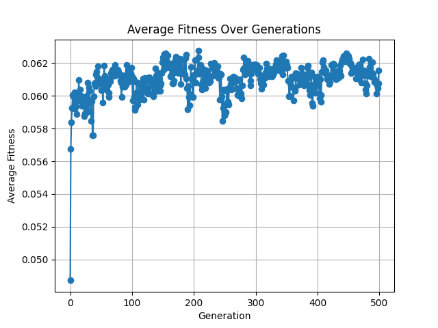

# Symbolic Regression Problem using Genetic Programming
This repository contains a basic implementation of symbolic regression using genetic programming in Python. The goal here is to evolve mathematical expressions that best fit a given dataset.
## Requirements
- Python 3.x
- Matplotlib
## Installation
1. Clone the repository:
    ```bash
    git clone https://github.com/conorglynn02/SymbolicRegression.git
    cd SymbolicRegression
    ```
2. Create a virtual environment (optional but recommended):
    ```bash
    python -m venv venv
    source venv/bin/activate  # On Windows use `venv\Scripts\activate`
    ```
3. Install the required packages:
    ```bash
    pip install -r requirements.txt
    ```
## Project Structure
- `main.py`: The main script to run the symbolic regression.
- `tree`: Folder containing tree structure implementations.
    - `tree.py`: Contains the implementation of the tree structure used in the genetic program.
    - `tree_node.py`: Contains the implementation of the nodes used in the tree structure.
- `population.py`: Creates the population of trees.
- `selection`: Folder containing selection methods for the genetic algorithm.
    - `selection_interface.py`: Abstract base class for selection methods.
    - `roulette.py`: Implements roulette wheel selection.
- `fitness.py`: Contains the implementation of the fitness functions.
- `evolve`: Folder containing genetic operators.
    - `crossover.py`: Contains crossover methods for the genetic program.
    - `mutation.py`: Contains mutation methods for the genetic program.
- `config`: Folder containing configuration files.
    - `config.json`: JSON file with configuration parameters for the genetic program.
    - `config.py`: Module to read configuration parameters from a JSON file.
- `dataset`: Folder containing datasets for symbolic regression.
    - `data.csv`: Sample dataset for testing the symbolic regression.
    - `data_loader.py`: Module to load datasets.
- `helper.py`: Contains helper functions for the genetic program.
- `plot_results.py`: Module to plot the results of the genetic program.
- `results`: Folder to store results and plots generated by the program.
## Usage
To run the genetic program for the Symbolic Regression problem, execute the following command:
```bash
python main.py
```
This will start the genetic program and display the progress towards the optimal solution.
## Configuration
### Config JSON
You can modify the parameters in config/config.json file to customise the genetic program:
e.g.:
```json
{
  "population_size": 100,
  "max_tree_height": 10,
  "max_generations": 500,
  "selection_method": "roulette",
  "crossover_rate": 0.9,
  "mutation_rate": 0.01,
}
```
### Data CSV
The dataset used for symbolic regression can be modified in dataset/data.csv file. The format is as follows:
Line 1: The target function.
Line 2: The variables used in the function.
Lines 3+: Data points with variable values.
```
2x + 3y
x, y
1, 2
-1, -2
0, 0
...
```
## Results
The results of the genetic program will be printed in the console, showing the average fitness scores over time.
Additionally, a plot of the average fitness history will be displayed at the end of the execution.
A sample plot is shown below:

